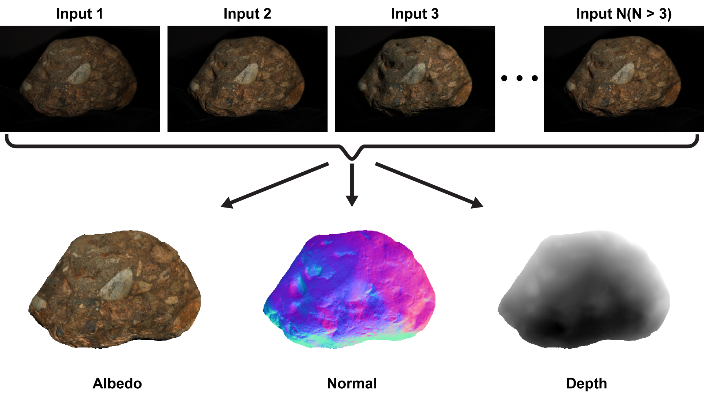

# photometric-stereo
Implementation of simple photometric stereo like below picture.

<div align="center">
  
</div>

## Environment
Ubuntu 18.04  
Python3.6(Anaconda3-5.2.0)


## Dependency

+ OpenCV3
+ numpy
+ sys
+ os
+ scipy


## Usage


### Dataset

Prepare proper images and masks for photometric stereo. In order to estimate light source direction, this code require chrome images that taken same lighting environment.  
  
Note that the images used in the example program are taken from the following project page: https://courses.cs.washington.edu/courses/cse455/10wi/projects/project4/psmImages_png.zip


### How to run

```
python main.py argvs[1] argvs[2] argvs[3]


argvs[1]  :  path to input folder   
-->  {abc}/{abc}.{number}.png, {abc}/{abc}.mask.png

argvs[2]  :  path to chrome folder   
-->  argvs[1] and argvs[2] have to taken same lighting condition

argvs[3]  :  number of image

Options:
windowsize: see mask2tiny function

```

## References

[1] [Woodham, Robert J](https://www.cs.ubc.ca/~woodham/). "Photometric method for determining surface orientation from multiple images." Optical engineering 19.1 (1980): 191139.
[[Paper](https://www.cs.ubc.ca/~woodham/papers/Woodham80c.pdf "Paper")]  
